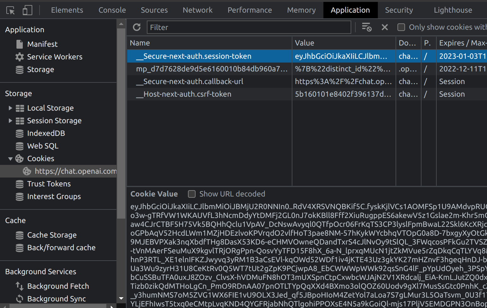

# ChatGPT API <!-- omit in toc -->

> Node.js client for the unofficial [ChatGPT](https://openai.com/blog/chatgpt/) API.

[](https://www.npmjs.com/package/chatgpt) [](https://github.com/transitive-bullshit/chatgpt-api/actions/workflows/test.yml) [](https://github.com/transitive-bullshit/chatgpt-api/blob/main/license) [](https://prettier.io)

- [Intro](#intro)
- [How it works](#how-it-works)
- [Install](#install)
- [Usage](#usage)
- [Docs](#docs)
- [Examples](#examples)
- [Credit](#credit)
- [License](#license)

## Intro

This package is a Node.js wrapper around [ChatGPT](https://openai.com/blog/chatgpt) by [OpenAI](https://openai.com). TS batteries included. ✨

You can use it to start building projects powered by ChatGPT like chatbots, websites, etc...

## How it works

This package requires a valid session token from OpenAI's ChatGPT webapp to access it's unofficial REST API.

1. Go to https://chat.openai.com/chat and log in or sign up
2. Open the dev tools console
3. Open `Application` > `Cookies`
   
4. Copy the value for `__Secure-next-auth.session-token` and save it to your environment.

If you want to run the built-in demo,

> **Note**
> This package will switch to using the official API once it's released.

> **Note**
> Prior to v1.0.0, this package used headless Chromium via [Playwright](https://playwright.dev/) to automate the web UI. Here are the [docs for the initial browser version](https://github.com/transitive-bullshit/chatgpt-api/tree/v0.4.2).

## Install

```bash
npm install --save chatgpt
# or
yarn add chatgpt
# or
pnpm add chatgpt
```

## Usage

```ts
import { ChatGPTAPI } from 'chatgpt'

async function example() {
  const api = new ChatGPTAPI()

  // ensure the API is properly authenticated (optional)
  await api.ensureAuth()

  // send a message and wait for the response
  const response = await api.sendMessage(
    'Write a python version of bubble sort. Do not include example usage.'
  )

  // response is a markdown-formatted string
  console.log(response)
}
```

A full [example](./src/example.ts) is included for testing purposes:

```bash
# 1. clone repo
# 2. install node deps
# 3. set `SESSION_TOKEN` in .env
# 4. run:
npx tsx src/example.ts
```

## Docs

See the [auto-generated docs](./docs/classes/ChatGPTAPI.md) for more info on methods and parameters.

## Examples

All of these awesome projects use the `chatgpt` package. 🤯

- [Twitter Bot](https://github.com/transitive-bullshit/chatgpt-twitter-bot) powered by ChatGPT ✨
  - Mention [@ChatGPTBot](https://twitter.com/ChatGPTBot) on Twitter with your prompt to try it out
- [Chrome Extension](https://github.com/gragland/chatgpt-everywhere) ([demo](https://twitter.com/gabe_ragland/status/1599466486422470656))
- [VSCode Extension](https://github.com/mpociot/chatgpt-vscode) ([demo](https://twitter.com/marcelpociot/status/1599180144551526400))
- [Go Telegram Bot](https://github.com/m1guelpf/chatgpt-telegram)
- [Github ProBot](https://github.com/oceanlvr/ChatGPTBot)
- [Lovelines.xyz](https://lovelines.xyz)

If you create a cool integration, feel free to open a PR and add it to the list.

## Credit

- Inspired by this [Go module](https://github.com/danielgross/whatsapp-gpt) by [Daniel Gross](https://github.com/danielgross)

## License

MIT © [Travis Fischer](https://transitivebullsh.it)

Support my open source work by <a href="https://twitter.com/transitive_bs">following me on twitter </a>
